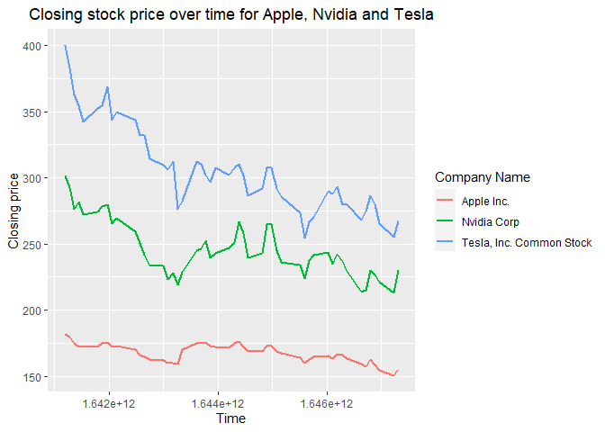
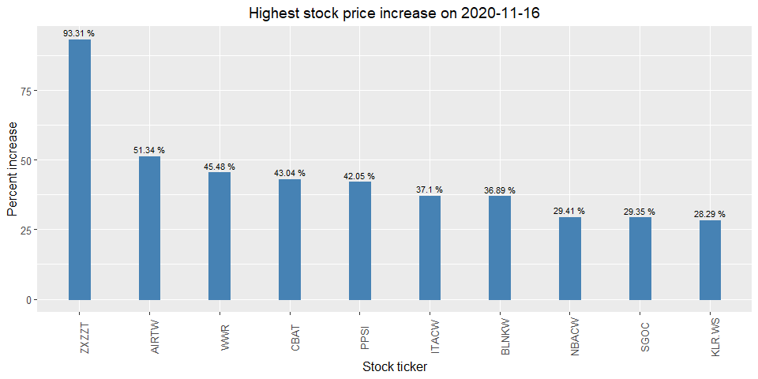
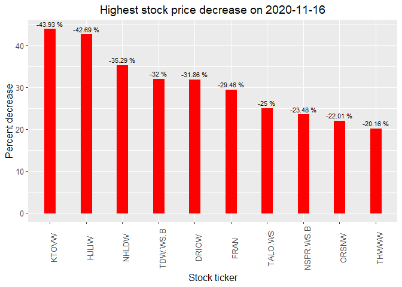
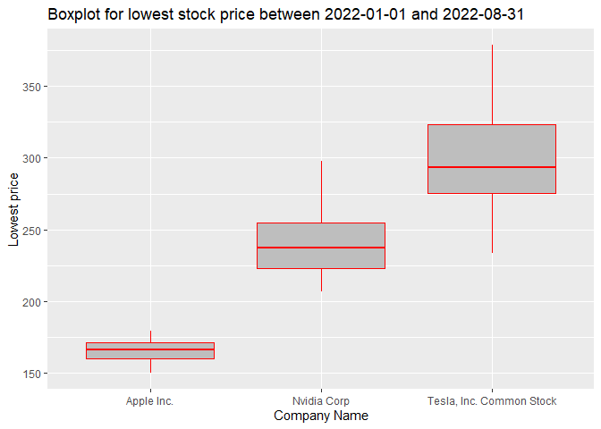
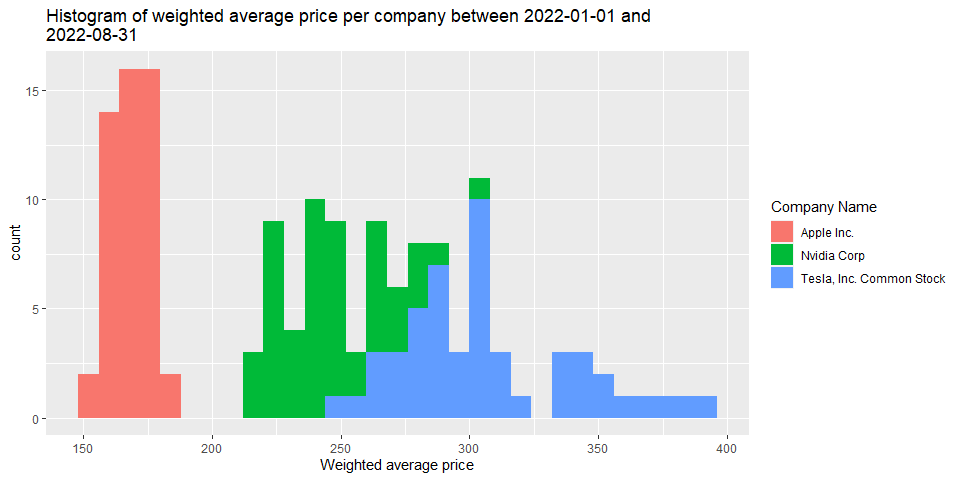
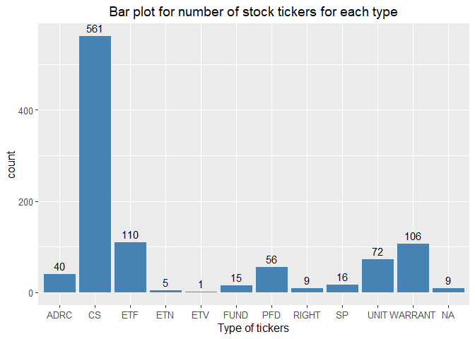
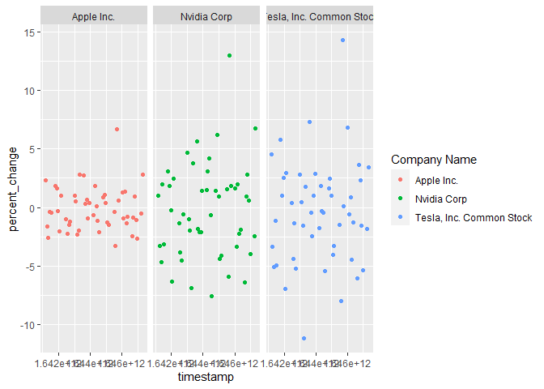

Project 2
================
Rohan Prabhune, Naman Goel
2022-10-12

# Required packages list

``` r
library(httr)
library(jsonlite)
library(tidyverse)
library(knitr)
library(ggplot2)
library(kableExtra)
library(patchwork)
library(rmarkdown)
```

<!--*************************************************************************-->

# Functions to query endpoints

## Endpoint 1 - Four modifications

``` r
get_stocks_agg <- function(ticker,company_name,start_date="2022-01-01",
                           end_date="2022-08-31",limit=50){
  url=paste0("https://api.polygon.io/v2/aggs/ticker/",ticker,
             "/range/1/day/",start_date,"/",end_date,
             "?adjusted=true&sort=asc&limit=",limit,"&apiKey=EdkA7_m2JhjS5POrGuXJbVlA4AjSl_4F")
  response_obj <- GET(url)
  parsed <- fromJSON(rawToChar(response_obj$content))
  df <- as_tibble(parsed$results)
  df <- df %>% rename(close_price=c,highest_price=h,lowest_price=l,num_transactions=n,
                      open_price=o,timestamp=t,vol=v,weighted_avg_price=vw) 
  df$ticker <- rep(ticker,limit)
  df$company_name <- rep(company_name,limit)
  df$start_date <- start_date
  df$end_date <- end_date
  df <- df %>% select(ticker,company_name,everything())
  return(df)
}
#TODO: Convert timestamp
```

## Endpoint 2 - Two modifications

Searches only stocks.Gives the first ticker if the name is not complete.
Limit is 1000 and its sorted in ascending order.

``` r
get_ticker_symbol <- function(name){
  url=paste0("https://api.polygon.io/v3/reference/tickers?market=stocks&search=",name,"&active=true&sort=ticker&order=asc&limit=1000&apiKey=EdkA7_m2JhjS5POrGuXJbVlA4AjSl_4F")
  response_obj <- GET(url)
  parsed<- fromJSON(rawToChar(response_obj$content))
  df <- as_tibble(parsed$results)
  return(list(df$ticker[[1]],df$name[[1]]))
}
```

``` r
get_ticker_info <- function(market){
  url=paste0("https://api.polygon.io/v3/reference/tickers?market=",market,"&active=true&sort=ticker&order=asc&limit=1000&apiKey=EdkA7_m2JhjS5POrGuXJbVlA4AjSl_4F")
  response_obj <- GET(url)
  parsed<- fromJSON(rawToChar(response_obj$content))
  df <- as_tibble(parsed$results) %>% select(ticker,name,primary_exchange,type)
  return(df)
}
```

## Endpoint 3 - One modification

``` r
get_grouped_daily <- function(date="2020-10-14"){
  url=paste0("https://api.polygon.io/v2/aggs/grouped/locale/us/market/stocks/",date,"?adjusted=true&include_otc=true&apiKey=EdkA7_m2JhjS5POrGuXJbVlA4AjSl_4F")
  response_obj <- GET(url)
  parsed <- fromJSON(rawToChar(response_obj$content))
  df <- as_tibble(parsed$results)
  df <- df %>% rename(Ticker=T,volume=v,weighted_avg_price=vw,open_price=o,
                      close_price=c,highest_price=h,lowest_price=l,
                      num_transactions=n,timestamp=t)
  df$date <- date
  return(df)
}
```

## Endpoint 4

``` r
get_ticker_type_details <- function(){
  response_obj <- GET("https://api.polygon.io/v3/reference/tickers/types?apiKey=EdkA7_m2JhjS5POrGuXJbVlA4AjSl_4F")
  parsed <- fromJSON(rawToChar(response_obj$content))
  df <- as_tibble(parsed$results) 
  return(df)
}
```

## Endpoint 5

``` r
get_exchanges_details <- function(){
  response_obj <- GET("https://api.polygon.io/v3/reference/exchanges?asset_class=stocks&apiKey=EdkA7_m2JhjS5POrGuXJbVlA4AjSl_4F")
  parsed <- fromJSON(rawToChar(response_obj$content))
  df <- as_tibble(parsed$results)  
  return(df)
}
```

<!--*************************************************************************-->

# Creation of relevant new variables

``` r
df_grouped <- get_grouped_daily("2020-11-16")
df_grouped <- df_grouped %>% mutate(percent_change = round(((close_price-open_price)/open_price)*100,2)) %>% arrange(desc(percent_change))
df_grouped$percent_change_chr <- paste(as.character(df_grouped$percent_change),'%')
df_grouped %>% select(Ticker,open_price,close_price,percent_change_chr,everything())
```

    ## # A tibble: 9,084 x 12
    ##    Ticker open_price close_price percent_change_chr    volume weight~1 highe~2 lowes~3 times~4 num_t~5 date  perce~6
    ##    <chr>       <dbl>       <dbl> <chr>                  <dbl>    <dbl>   <dbl>   <dbl>   <dbl>   <int> <chr>   <dbl>
    ##  1 ZXZZT     10.3        20.0    93.31 %                39298  13.3    20.0    10.3    1.61e12     332 2020~    93.3
    ##  2 AIRTW      0.0261      0.0395 51.34 %                49231   0.0374  0.0399  0.0261 1.61e12      19 2020~    51.3
    ##  3 WWR        4.31        6.27   45.48 %             36001534   5.43    6.3     4.22   1.61e12  117274 2020~    45.5
    ##  4 CBAT       7.9        11.3    43.04 %            107542895   9.22   11.4     7.15   1.61e12  463824 2020~    43.0
    ##  5 PPSI       3.02        4.29   42.05 %             12071799   4.02    4.48    3.02   1.61e12   43723 2020~    42.0
    ##  6 ITACW      0.350       0.48   37.1 %                 16290   0.401   0.48    0.350  1.61e12      10 2020~    37.1
    ##  7 BLNKW      5.74        7.86   36.89 %               283685   7.35    8.23    5.74   1.61e12    1493 2020~    36.9
    ##  8 NBACW      0.51        0.66   29.41 %               565422   0.587   0.680   0.51   1.61e12    1162 2020~    29.4
    ##  9 SGOC       0.92        1.19   29.35 %                33103   1.06    1.19    0.92   1.61e12      98 2020~    29.4
    ## 10 KLR.WS     1.06        1.36   28.29 %                 3978   1.10    1.36    1.06   1.61e12       7 2020~    28.3
    ## # ... with 9,074 more rows, and abbreviated variable names 1: weighted_avg_price, 2: highest_price,
    ## #   3: lowest_price, 4: timestamp, 5: num_transactions, 6: percent_change

<!--*************************************************************************-->

# Combining data from API Calls

``` r
ticker_symbol1 <- get_ticker_symbol(name="Apple")
df1 <- get_stocks_agg(ticker_symbol1[[1]],ticker_symbol1[[2]],start_date="2022-01-01",end_date="2022-08-31")
df1
```

    ## # A tibble: 50 x 12
    ##    ticker company_name       vol weighted_avg_price open_p~1 close~2 highe~3 lowes~4 times~5 num_t~6 start~7 end_d~8
    ##    <chr>  <chr>            <dbl>              <dbl>    <dbl>   <dbl>   <dbl>   <dbl>   <dbl>   <int> <chr>   <chr>  
    ##  1 AAPL   Apple Inc.   104677470               181.     178.    182.    183.    178. 1.64e12  772691 2022-0~ 2022-0~
    ##  2 AAPL   Apple Inc.    99110438               181.     183.    180.    183.    179. 1.64e12  831890 2022-0~ 2022-0~
    ##  3 AAPL   Apple Inc.    94535602               177.     180.    175.    180.    175. 1.64e12  848513 2022-0~ 2022-0~
    ##  4 AAPL   Apple Inc.    96882954               173.     173.    172     175.    172. 1.64e12  960340 2022-0~ 2022-0~
    ##  5 AAPL   Apple Inc.    86709147               172.     173.    172.    174.    171. 1.64e12  716881 2022-0~ 2022-0~
    ##  6 AAPL   Apple Inc.   106754551               170.     169.    172.    172.    168. 1.64e12  956337 2022-0~ 2022-0~
    ##  7 AAPL   Apple Inc.    76138312               174.     172.    175.    175.    171. 1.64e12  649652 2022-0~ 2022-0~
    ##  8 AAPL   Apple Inc.    74805173               176.     176.    176.    177.    175. 1.64e12  642756 2022-0~ 2022-0~
    ##  9 AAPL   Apple Inc.    84405760               174.     176.    172.    177.    172. 1.64e12  692343 2022-0~ 2022-0~
    ## 10 AAPL   Apple Inc.    80440778               172.     171.    173.    174.    171. 1.64e12  672552 2022-0~ 2022-0~
    ## # ... with 40 more rows, and abbreviated variable names 1: open_price, 2: close_price, 3: highest_price,
    ## #   4: lowest_price, 5: timestamp, 6: num_transactions, 7: start_date, 8: end_date

``` r
ticker_symbol2 <- get_ticker_symbol(name="Tesla")
df2 <- get_stocks_agg(ticker_symbol2[[1]],ticker_symbol2[[2]],start_date="2022-01-01",end_date="2022-08-31")
df2
```

    ## # A tibble: 50 x 12
    ##    ticker company_name                   vol weigh~1 open_~2 close~3 highe~4 lowes~5 times~6 num_t~7 start~8 end_d~9
    ##    <chr>  <chr>                        <dbl>   <dbl>   <dbl>   <dbl>   <dbl>   <dbl>   <dbl>   <int> <chr>   <chr>  
    ##  1 TSLA   Tesla, Inc. Common Stock 104686035    390.    383.    400.    400.    379. 1.64e12 1162844 2022-0~ 2022-0~
    ##  2 TSLA   Tesla, Inc. Common Stock  99798258    387.    397.    383.    403.    374. 1.64e12 1051467 2022-0~ 2022-0~
    ##  3 TSLA   Tesla, Inc. Common Stock  80119797    376.    382.    363.    390.    360. 1.64e12  811988 2022-0~ 2022-0~
    ##  4 TSLA   Tesla, Inc. Common Stock  90324504    353.    359     355.    363.    340. 1.64e12  880974 2022-0~ 2022-0~
    ##  5 TSLA   Tesla, Inc. Common Stock  83999748    346.    360.    342.    360.    337. 1.64e12  823560 2022-0~ 2022-0~
    ##  6 TSLA   Tesla, Inc. Common Stock  91814877    339.    333.    353.    353.    327. 1.64e12  971558 2022-0~ 2022-0~
    ##  7 TSLA   Tesla, Inc. Common Stock  66045210    353.    351.    355.    359.    346. 1.64e12  644108 2022-0~ 2022-0~
    ##  8 TSLA   Tesla, Inc. Common Stock  83739015    365.    360.    369.    372.    358. 1.64e12  761538 2022-0~ 2022-0~
    ##  9 TSLA   Tesla, Inc. Common Stock  96909162    356.    370.    344.    372.    342. 1.64e12  924351 2022-0~ 2022-0~
    ## 10 TSLA   Tesla, Inc. Common Stock  72916011    345.    340.    350.    351.    338. 1.64e12  710334 2022-0~ 2022-0~
    ## # ... with 40 more rows, and abbreviated variable names 1: weighted_avg_price, 2: open_price, 3: close_price,
    ## #   4: highest_price, 5: lowest_price, 6: timestamp, 7: num_transactions, 8: start_date, 9: end_date

``` r
ticker_symbol3 <- get_ticker_symbol(name="Nvidia")
df3 <- get_stocks_agg(ticker_symbol3[[1]],ticker_symbol3[[2]],start_date="2022-01-01",end_date="2022-08-31")
df3
```

    ## # A tibble: 50 x 12
    ##    ticker company_name      vol weighted_avg_price open_pr~1 close~2 highe~3 lowes~4 times~5 num_t~6 start~7 end_d~8
    ##    <chr>  <chr>           <dbl>              <dbl>     <dbl>   <dbl>   <dbl>   <dbl>   <dbl>   <int> <chr>   <chr>  
    ##  1 NVDA   Nvidia Corp  39240294               302.      298.    301.    307.    298. 1.64e12  585469 2022-0~ 2022-0~
    ##  2 NVDA   Nvidia Corp  52715440               291.      303.    293.    305.    283. 1.64e12  894297 2022-0~ 2022-0~
    ##  3 NVDA   Nvidia Corp  49806388               283.      289.    276.    294.    275. 1.64e12  836624 2022-0~ 2022-0~
    ##  4 NVDA   Nvidia Corp  45418636               280.      276.    282.    284.    271. 1.64e12  725603 2022-0~ 2022-0~
    ##  5 NVDA   Nvidia Corp  40993851               275.      281.    272.    284.    271. 1.64e12  639610 2022-0~ 2022-0~
    ##  6 NVDA   Nvidia Corp  59461560               264.      266.    274     275.    256. 1.64e12  991811 2022-0~ 2022-0~
    ##  7 NVDA   Nvidia Corp  40408929               275.      273.    278.    281.    268. 1.64e12  572165 2022-0~ 2022-0~
    ##  8 NVDA   Nvidia Corp  38341346               281.      281.    280.    286.    276. 1.64e12  562208 2022-0~ 2022-0~
    ##  9 NVDA   Nvidia Corp  53857879               271.      284.    266.    285.    265. 1.64e12  845316 2022-0~ 2022-0~
    ## 10 NVDA   Nvidia Corp  39583233               268.      263     269.    272.    262. 1.64e12  620045 2022-0~ 2022-0~
    ## # ... with 40 more rows, and abbreviated variable names 1: open_price, 2: close_price, 3: highest_price,
    ## #   4: lowest_price, 5: timestamp, 6: num_transactions, 7: start_date, 8: end_date

``` r
df_combined <- bind_rows(df1, df2, df3)
ggplot(df_combined,aes(x=timestamp,y=close_price)) + geom_line(aes(color=company_name),size=1) + labs(x="Time",y="Closing price",title="Closing stock price over time for Apple, Nvidia and Tesla") +  scale_color_discrete(name = "Company Name")+theme(plot.title = element_text(hjust = 0.5))
```



<!--*************************************************************************-->

# Contingency tables

``` r
df_info <- get_ticker_info("stocks")

tab1 <- table(df_info$type,dnn=c("Ticker Types"))
tab2 <- table(df_info$type,df_info$primary_exchange,dnn=c("Ticker Types","Exchanges"))

tab1 %>%
  kbl(caption="Table for Ticker Types") %>%
  kable_classic(full_width = F)
```

<table class=" lightable-classic" style="font-family: &quot;Arial Narrow&quot;, &quot;Source Sans Pro&quot;, sans-serif; width: auto !important; margin-left: auto; margin-right: auto;">
<caption>
Table for Ticker Types
</caption>
<thead>
<tr>
<th style="text-align:left;">
Ticker.Types
</th>
<th style="text-align:right;">
Freq
</th>
</tr>
</thead>
<tbody>
<tr>
<td style="text-align:left;">
ADRC
</td>
<td style="text-align:right;">
40
</td>
</tr>
<tr>
<td style="text-align:left;">
CS
</td>
<td style="text-align:right;">
561
</td>
</tr>
<tr>
<td style="text-align:left;">
ETF
</td>
<td style="text-align:right;">
110
</td>
</tr>
<tr>
<td style="text-align:left;">
ETN
</td>
<td style="text-align:right;">
5
</td>
</tr>
<tr>
<td style="text-align:left;">
ETV
</td>
<td style="text-align:right;">
1
</td>
</tr>
<tr>
<td style="text-align:left;">
FUND
</td>
<td style="text-align:right;">
15
</td>
</tr>
<tr>
<td style="text-align:left;">
PFD
</td>
<td style="text-align:right;">
56
</td>
</tr>
<tr>
<td style="text-align:left;">
RIGHT
</td>
<td style="text-align:right;">
9
</td>
</tr>
<tr>
<td style="text-align:left;">
SP
</td>
<td style="text-align:right;">
16
</td>
</tr>
<tr>
<td style="text-align:left;">
UNIT
</td>
<td style="text-align:right;">
72
</td>
</tr>
<tr>
<td style="text-align:left;">
WARRANT
</td>
<td style="text-align:right;">
106
</td>
</tr>
</tbody>
</table>

``` r
tab2 %>%
  kbl(caption="Table for Ticker Types and Exchanges") %>%
  kable_classic(full_width = F)
```

<table class=" lightable-classic" style="font-family: &quot;Arial Narrow&quot;, &quot;Source Sans Pro&quot;, sans-serif; width: auto !important; margin-left: auto; margin-right: auto;">
<caption>
Table for Ticker Types and Exchanges
</caption>
<thead>
<tr>
<th style="text-align:left;">
</th>
<th style="text-align:right;">
ARCX
</th>
<th style="text-align:right;">
BATS
</th>
<th style="text-align:right;">
XASE
</th>
<th style="text-align:right;">
XNAS
</th>
<th style="text-align:right;">
XNYS
</th>
</tr>
</thead>
<tbody>
<tr>
<td style="text-align:left;">
ADRC
</td>
<td style="text-align:right;">
0
</td>
<td style="text-align:right;">
0
</td>
<td style="text-align:right;">
1
</td>
<td style="text-align:right;">
23
</td>
<td style="text-align:right;">
16
</td>
</tr>
<tr>
<td style="text-align:left;">
CS
</td>
<td style="text-align:right;">
0
</td>
<td style="text-align:right;">
0
</td>
<td style="text-align:right;">
19
</td>
<td style="text-align:right;">
359
</td>
<td style="text-align:right;">
183
</td>
</tr>
<tr>
<td style="text-align:left;">
ETF
</td>
<td style="text-align:right;">
71
</td>
<td style="text-align:right;">
17
</td>
<td style="text-align:right;">
0
</td>
<td style="text-align:right;">
22
</td>
<td style="text-align:right;">
0
</td>
</tr>
<tr>
<td style="text-align:left;">
ETN
</td>
<td style="text-align:right;">
5
</td>
<td style="text-align:right;">
0
</td>
<td style="text-align:right;">
0
</td>
<td style="text-align:right;">
0
</td>
<td style="text-align:right;">
0
</td>
</tr>
<tr>
<td style="text-align:left;">
ETV
</td>
<td style="text-align:right;">
1
</td>
<td style="text-align:right;">
0
</td>
<td style="text-align:right;">
0
</td>
<td style="text-align:right;">
0
</td>
<td style="text-align:right;">
0
</td>
</tr>
<tr>
<td style="text-align:left;">
FUND
</td>
<td style="text-align:right;">
0
</td>
<td style="text-align:right;">
0
</td>
<td style="text-align:right;">
1
</td>
<td style="text-align:right;">
0
</td>
<td style="text-align:right;">
14
</td>
</tr>
<tr>
<td style="text-align:left;">
PFD
</td>
<td style="text-align:right;">
0
</td>
<td style="text-align:right;">
0
</td>
<td style="text-align:right;">
0
</td>
<td style="text-align:right;">
8
</td>
<td style="text-align:right;">
48
</td>
</tr>
<tr>
<td style="text-align:left;">
RIGHT
</td>
<td style="text-align:right;">
0
</td>
<td style="text-align:right;">
0
</td>
<td style="text-align:right;">
0
</td>
<td style="text-align:right;">
9
</td>
<td style="text-align:right;">
0
</td>
</tr>
<tr>
<td style="text-align:left;">
SP
</td>
<td style="text-align:right;">
0
</td>
<td style="text-align:right;">
0
</td>
<td style="text-align:right;">
0
</td>
<td style="text-align:right;">
0
</td>
<td style="text-align:right;">
16
</td>
</tr>
<tr>
<td style="text-align:left;">
UNIT
</td>
<td style="text-align:right;">
0
</td>
<td style="text-align:right;">
0
</td>
<td style="text-align:right;">
2
</td>
<td style="text-align:right;">
51
</td>
<td style="text-align:right;">
19
</td>
</tr>
<tr>
<td style="text-align:left;">
WARRANT
</td>
<td style="text-align:right;">
0
</td>
<td style="text-align:right;">
0
</td>
<td style="text-align:right;">
3
</td>
<td style="text-align:right;">
78
</td>
<td style="text-align:right;">
25
</td>
</tr>
</tbody>
</table>
<!--*************************************************************************-->

# Numerical summaries

``` r
df_combined <- bind_rows(df1, df2, df3)
start_date = as.character(unique(df_combined$start_date))
end_date = as.character(unique(df_combined$end_date))
# Open Price
df_combined_open <- df_combined %>% 
  group_by(company_name) %>% 
  summarise("Min." = min(open_price),
            "1st Quartile" = quantile(open_price,0.25),
            "Median." = median(open_price),
            "Mean."=mean(open_price),
            "3rd Quartile" = quantile(open_price,0.75),
            "Max."= max(open_price),
            "Std. Dev." = sd(open_price))

# Close Price
df_combined_close <- df_combined %>% 
  group_by(company_name) %>% 
  summarise("Min." = min(close_price),
            "1st Quartile" = quantile(close_price,0.25),
            "Median." = median(close_price),
            "Mean."=mean(close_price),
            "3rd Quartile" = quantile(close_price,0.75),
            "Max."= max(close_price),
            "Std. Dev." = sd(close_price))

df_combined_open %>%
  kbl(caption=paste0("Summary Statistics for Open Price per Company between ",start_date," and ",end_date)) %>%
  kable_classic()
```

<table class=" lightable-classic" style="font-family: &quot;Arial Narrow&quot;, &quot;Source Sans Pro&quot;, sans-serif; margin-left: auto; margin-right: auto;">
<caption>
Summary Statistics for Open Price per Company between 2022-01-01 and
2022-08-31
</caption>
<thead>
<tr>
<th style="text-align:left;">
company\_name
</th>
<th style="text-align:right;">
Min.
</th>
<th style="text-align:right;">
1st Quartile
</th>
<th style="text-align:right;">
Median.
</th>
<th style="text-align:right;">
Mean.
</th>
<th style="text-align:right;">
3rd Quartile
</th>
<th style="text-align:right;">
Max.
</th>
<th style="text-align:right;">
Std. Dev.
</th>
</tr>
</thead>
<tbody>
<tr>
<td style="text-align:left;">
Apple Inc. 
</td>
<td style="text-align:right;">
150.9000
</td>
<td style="text-align:right;">
163.5850
</td>
<td style="text-align:right;">
169.4500
</td>
<td style="text-align:right;">
167.8854
</td>
<td style="text-align:right;">
172.6075
</td>
<td style="text-align:right;">
182.6300
</td>
<td style="text-align:right;">
7.00711
</td>
</tr>
<tr>
<td style="text-align:left;">
Nvidia Corp
</td>
<td style="text-align:right;">
210.1500
</td>
<td style="text-align:right;">
231.9650
</td>
<td style="text-align:right;">
243.2500
</td>
<td style="text-align:right;">
247.4482
</td>
<td style="text-align:right;">
260.5800
</td>
<td style="text-align:right;">
302.7700
</td>
<td style="text-align:right;">
22.16117
</td>
</tr>
<tr>
<td style="text-align:left;">
Tesla, Inc. Common Stock
</td>
<td style="text-align:right;">
233.4633
</td>
<td style="text-align:right;">
284.2208
</td>
<td style="text-align:right;">
302.3166
</td>
<td style="text-align:right;">
308.5580
</td>
<td style="text-align:right;">
333.0283
</td>
<td style="text-align:right;">
396.5167
</td>
<td style="text-align:right;">
35.48938
</td>
</tr>
</tbody>
</table>

``` r
df_combined_close %>%
  kbl(caption=paste0("Summary Statistics for Close Price per Company between ",start_date," and ",end_date)) %>%
  kable_classic()
```

<table class=" lightable-classic" style="font-family: &quot;Arial Narrow&quot;, &quot;Source Sans Pro&quot;, sans-serif; margin-left: auto; margin-right: auto;">
<caption>
Summary Statistics for Close Price per Company between 2022-01-01 and
2022-08-31
</caption>
<thead>
<tr>
<th style="text-align:left;">
company\_name
</th>
<th style="text-align:right;">
Min.
</th>
<th style="text-align:right;">
1st Quartile
</th>
<th style="text-align:right;">
Median.
</th>
<th style="text-align:right;">
Mean.
</th>
<th style="text-align:right;">
3rd Quartile
</th>
<th style="text-align:right;">
Max.
</th>
<th style="text-align:right;">
Std. Dev.
</th>
</tr>
</thead>
<tbody>
<tr>
<td style="text-align:left;">
Apple Inc. 
</td>
<td style="text-align:right;">
150.62
</td>
<td style="text-align:right;">
162.7925
</td>
<td style="text-align:right;">
168.7600
</td>
<td style="text-align:right;">
167.6362
</td>
<td style="text-align:right;">
172.7300
</td>
<td style="text-align:right;">
182.0100
</td>
<td style="text-align:right;">
6.987583
</td>
</tr>
<tr>
<td style="text-align:left;">
Nvidia Corp
</td>
<td style="text-align:right;">
213.30
</td>
<td style="text-align:right;">
231.0350
</td>
<td style="text-align:right;">
242.4350
</td>
<td style="text-align:right;">
246.5286
</td>
<td style="text-align:right;">
263.4700
</td>
<td style="text-align:right;">
301.2100
</td>
<td style="text-align:right;">
21.101257
</td>
</tr>
<tr>
<td style="text-align:left;">
Tesla, Inc. Common Stock
</td>
<td style="text-align:right;">
254.68
</td>
<td style="text-align:right;">
280.3517
</td>
<td style="text-align:right;">
302.1667
</td>
<td style="text-align:right;">
306.7592
</td>
<td style="text-align:right;">
327.5708
</td>
<td style="text-align:right;">
399.9267
</td>
<td style="text-align:right;">
34.140396
</td>
</tr>
</tbody>
</table>
<!--*************************************************************************-->

# Plots

Did not map the ticker symbol to the company name because there is a max
limit of 1000 on the “Ticker” reference end point. So we do not get all
the data.

## Plotting new created variable

``` r
#Top-10 increases
df_top10 <- head(df_grouped, 10)
df_top10$Ticker <- factor(df_top10$Ticker, levels=df_top10$Ticker[order(-df_top10$percent_change)])

# Plot
date <- unique(df_top10$date)
ggplot(df_top10, aes(x=Ticker, y=percent_change)) + 
geom_col(width=0.3, color='steelblue', fill='steelblue') + 
theme(axis.text.x=element_text(angle=90), text=element_text(size=12), plot.title = element_text(hjust = 0.5)) + labs(y="Percent increase", x ="Stock ticker",title = paste0("Highest stock price increase on ",date)) + geom_text(aes(label = percent_change_chr), vjust = -0.5, size=3)
```



``` r
#Top-10 decreases
df_bottom10 <- tail(df_grouped, 10)
df_bottom10$percent_change <- abs(df_bottom10$percent_change)
df_bottom10$Ticker <- factor(df_bottom10$Ticker, levels=df_bottom10$Ticker[order(-df_bottom10$percent_change)])

# Plot
date = unique(df_bottom10$date)
ggplot(df_bottom10, aes(x=Ticker, y=percent_change)) + 
geom_col(width=0.3, color='red', fill='red') + 
theme(axis.text.x = element_text(angle=90),text = element_text(size=12),plot.title = element_text(hjust = 0.5)) + labs(y="Percent decrease", x ="Stock ticker", title = paste0("Highest stock price decrease on ",date)) + geom_text(aes(label=percent_change_chr), vjust =-0.5, size=3)
```



## Box plots for highest and lowest price per company in a given time period

``` r
start_date = as.character(unique(df_combined$start_date))
end_date = as.character(unique(df_combined$end_date))

ggplot(df_combined, aes(x=company_name, y=highest_price)) + geom_boxplot(color="blue",fill="grey") + labs(y="Highest price", x ="Company Name", title=paste0("Boxplot for highest stock price between ",start_date," and ",end_date)) 
```


``` r
ggplot(df_combined, aes(x=company_name, y=lowest_price)) + geom_boxplot(color="red",fill="grey") + labs(y="Lowest price", x ="Company Name", title=paste0("Boxplot for lowest stock price between ",start_date," and ",end_date)) 
```



## Histogram

``` r
start_date = as.character(unique(df_combined$start_date))
end_date = as.character(unique(df_combined$end_date))

my_title <- paste0("Histogram of weighted average price per company between ",start_date," and ",end_date)
ggplot(df_combined, aes(x=weighted_avg_price)) + geom_histogram(aes(fill=company_name),binwidth=8) + labs(x ="Weighted average price") + scale_fill_discrete(name = "Company Name") + ggtitle(wrapper(my_title, width=80))
```



## Bar plot

``` r
ggplot(df_info, aes(x=type)) + geom_bar(fill="steelblue") + labs(x ="Type of tickers",title="Bar plot for number of stock tickers for each type") + theme(text=element_text(size=12), plot.title = element_text(hjust = 0.5)) + geom_text(aes(label = ..count..), stat = "count", vjust = -0.5)
```



## Scatter plot

The scatter plot has been used to plot the percentage change in returns
for the stocks Apple, Tesla and Nvidia for a date range and can be
differentiated based on the different colours. From the plot, we can see
how varied returns have been on a daily basis but if we look carefully
we can see that there is a certain correlation in the returns and on
most days the movement for all 3 technology stocks is in the same
direction of either gaining or losing

``` r
df_comb <- df_combined %>% mutate(percent_change = round(((close_price-open_price)/open_price)*100,2))
ggplot(df_comb, aes(x=timestamp, y=percent_change, color=ticker)) + geom_point()
```


