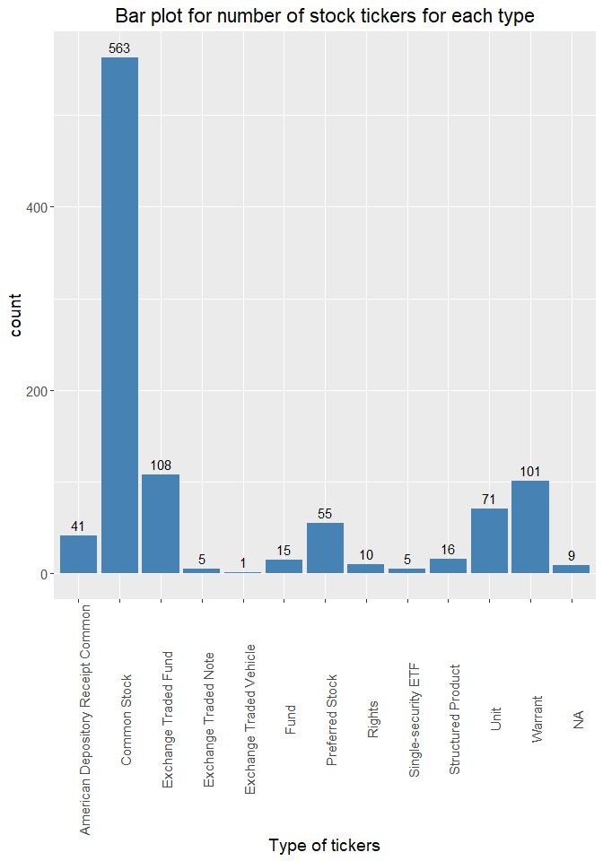

ST558- Project 2
================
Rohan Prabhune, Naman Goel

-   [Interacting with APIs: Financial Market
    Data](#interacting-with-apis-financial-market-data)
    -   [Requirements](#requirements)
    -   [API Interaction Functions](#api-interaction-functions)
        -   [Aggregates (Bars) Endpoint](#aggregates-bars-endpoint)
            -   [`get_stocks_agg`](#get_stocks_agg)
        -   [Tickers Endpoint](#tickers-endpoint)
            -   [`get_ticker`](#get_ticker)
            -   [`get_ticker_info`](#get_ticker_info)
        -   [Grouped Daily (Bars)
            Endpoint](#grouped-daily-bars-endpoint)
            -   [`get_grouped_daily`](#get_grouped_daily)
        -   [Ticker Types Endpoint](#ticker-types-endpoint)
            -   [`get_ticker_type_details`](#get_ticker_type_details)
        -   [Exchanges Endpoint](#exchanges-endpoint)
            -   [`get_exchanges_details`](#get_exchanges_details)
-   [Exploratory Data Analysis (EDA)](#exploratory-data-analysis-eda)
    -   [Combining data from API Calls](#combining-data-from-api-calls)
    -   [Creation of new variables](#creation-of-new-variables)
        -   [Plot for new variable](#plot-for-new-variable)
    -   [Contingency tables](#contingency-tables)
        -   [One-way](#one-way)
        -   [Two-way](#two-way)
    -   [Numerical summaries](#numerical-summaries)
    -   [Box plots](#box-plots)
    -   [Histogram](#histogram)
    -   [Bar plot](#bar-plot)
    -   [Scatter plot](#scatter-plot)
-   [Wrap- Up](#wrap--up)

# Interacting with APIs: Financial Market Data

This vignette shows how to work with API. This will demonstrate how to
fetch data from multiple API endpoints and read it in a tibble(data
frame). This is followed by some basic exploratory data analysis (EDA)
to produce some plots to derive insights from the data fetched.  
The API that we have chosen for this project is [Financial Market
Data](https://polygon.io/docs/stocks).The Polygon.io Stocks API provides
REST endpoints that let you query the latest market data from all US
stock exchanges.

## Requirements

We used the following packages in the creation of the vignette:

-   `httr`: This is used to access the REST API endpoint.  
-   `jsonlite`: This is used to parse the fetched data into a data
    frame.  
-   `tidyverse`: This provides two important packages `dplyr` and
    `ggplot` which are used for data manipulation and plotting
    respectively.  
-   `kableExtra`: This provides better printing properties for
    contingency tables in markdown.

To get started, install(if these are not installed already) and load the
following packages:

``` r
library(httr)
library(jsonlite)
library(tidyverse)
library(kableExtra)
```

<!--*************************************************************************-->

## API Interaction Functions

This section describes the functions created by us to interact with the
API endpoints to fetch data as well as some metadata required for making
the plots more descriptive.

### [Aggregates (Bars)](https://polygon.io/docs/stocks/get_v2_aggs_ticker__stocksticker__range__multiplier___timespan___from___to) Endpoint

Get financial data for a stock within a given time frame

#### `get_stocks_agg`

This function has four modifications from the user. The user can provide
the following inputs to the functions:

-   **ticker** and **company\_name**: The ticker symbol and registered
    name of the company. If the user does not have this information,
    this can be fetched using `get_ticker` function described ahead.  
-   **start\_date**: The start of the time window (A date with the
    format YYYY-MM-DD).  
-   **end\_date**: The end of the time window (A date with the format
    YYYY-MM-DD).  
-   **limit**: Limits the number of entries queried to create the
    aggregate results.

This function returns a data frame with the close price, open price,
highest price, lowest price etc for the stock over the given date range.

``` r
get_stocks_agg <- function(ticker,company_name,start_date="2022-01-01",
                           end_date="2022-08-31",limit=50){
  url=paste0("https://api.polygon.io/v2/aggs/ticker/",ticker,
             "/range/1/day/",start_date,"/",end_date,
             "?adjusted=true&sort=asc&limit=",limit,"&apiKey=EdkA7_m2JhjS5POrGuXJbVlA4AjSl_4F")
  response_obj <- GET(url)
  parsed <- fromJSON(rawToChar(response_obj$content))
  df <- as_tibble(parsed$results)
  df <- df %>% rename(close_price=c,highest_price=h,lowest_price=l,num_transactions=n,
                      open_price=o,timestamp=t,vol=v,weighted_avg_price=vw) 
  df$ticker <- rep(ticker,limit)
  df$company_name <- rep(company_name,limit)
  df$start_date <- start_date
  df$end_date <- end_date
  df <- df %>% select(ticker,company_name,everything())
  return(df)
}
```

### [Tickers](https://polygon.io/docs/stocks/get_v3_reference_tickers) Endpoint

Query all ticker symbols which are supported by Polygon.io. This API
currently includes Stocks/Equities, Cryptocurrencies, and
Currencies/Foreign Exchange.

#### `get_ticker`

This function searches only the stock market. The user can provide the
name of the company which they would like the ticker information for For
example: If a user wants the ticker, the ticker information for Apple,
the user can call the function as `get_ticker(name="Apple")`. This
function will return the ticker symbol **AAPL** and the registered
company name **Apple Inc.** as a list. The user can pass on the contents
of this list to `get_stocks_agg` function mentioned above to get the
aggregate bars over a date range. If there are multiple matches for a
given name, the function returns the first ticker information from the
list of matches.

``` r
get_ticker <- function(name){
  url=paste0("https://api.polygon.io/v3/reference/tickers?market=stocks&search=",name,"&active=true&sort=ticker&order=asc&limit=1000&apiKey=EdkA7_m2JhjS5POrGuXJbVlA4AjSl_4F")
  response_obj <- GET(url)
  parsed<- fromJSON(rawToChar(response_obj$content))
  df <- as_tibble(parsed$results)
  return(list(df$ticker[[1]],df$name[[1]]))
}
```

#### `get_ticker_info`

This function provides details of the ticker for a given market. The
user can provide the value for **market** to this function. The possible
values of market can be **stocks**, **crypto**, **fx** or **otc**. This
function returns the primary exchange and type of ticker information for
each security in each market.

``` r
get_ticker_info <- function(market){
  url=paste0("https://api.polygon.io/v3/reference/tickers?market=",market,"&active=true&sort=ticker&order=asc&limit=1000&apiKey=EdkA7_m2JhjS5POrGuXJbVlA4AjSl_4F")
  response_obj <- GET(url)
  parsed<- fromJSON(rawToChar(response_obj$content))
  df <- as_tibble(parsed$results) %>% select(ticker,name,primary_exchange,type)
  return(df)
}
```

### [Grouped Daily (Bars)](https://polygon.io/docs/stocks/get_v2_aggs_grouped_locale_us_market_stocks__date) Endpoint

Get the daily open, high, low, and close (OHLC) for the entire universe
of stocks

#### `get_grouped_daily`

This function takes in **date** as an input from the user and returns
the open, high, low, and close (OHLC) for the entire stocks markets for
that particular date.

``` r
get_grouped_daily <- function(date="2020-10-14"){
  url=paste0("https://api.polygon.io/v2/aggs/grouped/locale/us/market/stocks/",date,"?adjusted=true&include_otc=true&apiKey=EdkA7_m2JhjS5POrGuXJbVlA4AjSl_4F")
  response_obj <- GET(url)
  parsed <- fromJSON(rawToChar(response_obj$content))
  df <- as_tibble(parsed$results)
  df <- df %>% rename(Ticker=T,volume=v,weighted_avg_price=vw,open_price=o,
                      close_price=c,highest_price=h,lowest_price=l,
                      num_transactions=n,timestamp=t)
  df$date <- date
  return(df)
}
```

### [Ticker Types](https://polygon.io/docs/stocks/get_v3_reference_tickers_types) Endpoint

#### `get_ticker_type_details`

This function is used to get the metadata information of all the ticker
types that Polygon.io has data for.

``` r
get_ticker_type_details <- function(){
  response_obj <- GET("https://api.polygon.io/v3/reference/tickers/types?apiKey=EdkA7_m2JhjS5POrGuXJbVlA4AjSl_4F")
  parsed <- fromJSON(rawToChar(response_obj$content))
  df <- as_tibble(parsed$results) 
  return(df)
}
```

### [Exchanges](https://polygon.io/docs/stocks/get_v3_reference_exchanges) Endpoint

#### `get_exchanges_details`

This function is used to get metadata information of all the stock
exchanges that Polygon.io has data for.

``` r
get_exchanges_details <- function(){
  response_obj <- GET("https://api.polygon.io/v3/reference/exchanges?asset_class=stocks&apiKey=EdkA7_m2JhjS5POrGuXJbVlA4AjSl_4F")
  parsed <- fromJSON(rawToChar(response_obj$content))
  df <- as_tibble(parsed$results)  
  return(df)
}
```

<!--*************************************************************************-->

# Exploratory Data Analysis (EDA)

## Combining data from API Calls

Here we have called the data of 3 stocks namely Apple, Tesla and Nvidia
from 1 Jan 2022 to 31 August 2022.  
To find the stock information for Apple, we have passed “Apple” as an
input argument to `get_ticker` function. This function returns a list
`ticker_symbol1` which consists of ticker symbol “AAPL” and name of the
company which is “Apple Inc.”. The same was repeated for the other 2
symbols as well.

This information along with start date and end date is passed to the
function `get_stocks_agg`. The limit argument is not passed, so the
function takes the default value of 50. This function fetches the stock
information for Apple in the given date range and returns a data frame
`df1`. Similarly, this is done to get the stocks information for Tesla
and Nvidia in `df2` and `df3` respectively.

``` r
ticker_symbol1 <- get_ticker(name="Apple")
df1 <- get_stocks_agg(ticker_symbol1[[1]],ticker_symbol1[[2]],start_date="2022-01-01",end_date="2022-08-31")
df1
```

    ## # A tibble: 50 x 12
    ##    ticker company_name       vol weighted_avg_price open_p~1 close~2 highe~3 lowes~4 times~5 num_t~6 start~7 end_d~8
    ##    <chr>  <chr>            <dbl>              <dbl>    <dbl>   <dbl>   <dbl>   <dbl>   <dbl>   <int> <chr>   <chr>  
    ##  1 AAPL   Apple Inc.   104677470               181.     178.    182.    183.    178. 1.64e12  772691 2022-0~ 2022-0~
    ##  2 AAPL   Apple Inc.    99110438               181.     183.    180.    183.    179. 1.64e12  831890 2022-0~ 2022-0~
    ##  3 AAPL   Apple Inc.    94535602               177.     180.    175.    180.    175. 1.64e12  848513 2022-0~ 2022-0~
    ##  4 AAPL   Apple Inc.    96882954               173.     173.    172     175.    172. 1.64e12  960340 2022-0~ 2022-0~
    ##  5 AAPL   Apple Inc.    86709147               172.     173.    172.    174.    171. 1.64e12  716881 2022-0~ 2022-0~
    ##  6 AAPL   Apple Inc.   106754551               170.     169.    172.    172.    168. 1.64e12  956337 2022-0~ 2022-0~
    ##  7 AAPL   Apple Inc.    76138312               174.     172.    175.    175.    171. 1.64e12  649652 2022-0~ 2022-0~
    ##  8 AAPL   Apple Inc.    74805173               176.     176.    176.    177.    175. 1.64e12  642756 2022-0~ 2022-0~
    ##  9 AAPL   Apple Inc.    84405760               174.     176.    172.    177.    172. 1.64e12  692343 2022-0~ 2022-0~
    ## 10 AAPL   Apple Inc.    80440778               172.     171.    173.    174.    171. 1.64e12  672552 2022-0~ 2022-0~
    ## # ... with 40 more rows, and abbreviated variable names 1: open_price, 2: close_price, 3: highest_price,
    ## #   4: lowest_price, 5: timestamp, 6: num_transactions, 7: start_date, 8: end_date

``` r
ticker_symbol2 <- get_ticker(name="Tesla")
df2 <- get_stocks_agg(ticker_symbol2[[1]],ticker_symbol2[[2]],start_date="2022-01-01",end_date="2022-08-31")
df2
```

    ## # A tibble: 50 x 12
    ##    ticker company_name                   vol weigh~1 open_~2 close~3 highe~4 lowes~5 times~6 num_t~7 start~8 end_d~9
    ##    <chr>  <chr>                        <dbl>   <dbl>   <dbl>   <dbl>   <dbl>   <dbl>   <dbl>   <int> <chr>   <chr>  
    ##  1 TSLA   Tesla, Inc. Common Stock 104686035    390.    383.    400.    400.    379. 1.64e12 1162844 2022-0~ 2022-0~
    ##  2 TSLA   Tesla, Inc. Common Stock  99798258    387.    397.    383.    403.    374. 1.64e12 1051467 2022-0~ 2022-0~
    ##  3 TSLA   Tesla, Inc. Common Stock  80119797    376.    382.    363.    390.    360. 1.64e12  811988 2022-0~ 2022-0~
    ##  4 TSLA   Tesla, Inc. Common Stock  90324504    353.    359     355.    363.    340. 1.64e12  880974 2022-0~ 2022-0~
    ##  5 TSLA   Tesla, Inc. Common Stock  83999748    346.    360.    342.    360.    337. 1.64e12  823560 2022-0~ 2022-0~
    ##  6 TSLA   Tesla, Inc. Common Stock  91814877    339.    333.    353.    353.    327. 1.64e12  971558 2022-0~ 2022-0~
    ##  7 TSLA   Tesla, Inc. Common Stock  66045210    353.    351.    355.    359.    346. 1.64e12  644108 2022-0~ 2022-0~
    ##  8 TSLA   Tesla, Inc. Common Stock  83739015    365.    360.    369.    372.    358. 1.64e12  761538 2022-0~ 2022-0~
    ##  9 TSLA   Tesla, Inc. Common Stock  96909162    356.    370.    344.    372.    342. 1.64e12  924351 2022-0~ 2022-0~
    ## 10 TSLA   Tesla, Inc. Common Stock  72916011    345.    340.    350.    351.    338. 1.64e12  710334 2022-0~ 2022-0~
    ## # ... with 40 more rows, and abbreviated variable names 1: weighted_avg_price, 2: open_price, 3: close_price,
    ## #   4: highest_price, 5: lowest_price, 6: timestamp, 7: num_transactions, 8: start_date, 9: end_date

``` r
ticker_symbol3 <- get_ticker(name="Nvidia")
df3 <- get_stocks_agg(ticker_symbol3[[1]],ticker_symbol3[[2]],start_date="2022-01-01",end_date="2022-08-31")
df3
```

    ## # A tibble: 50 x 12
    ##    ticker company_name      vol weighted_avg_price open_pr~1 close~2 highe~3 lowes~4 times~5 num_t~6 start~7 end_d~8
    ##    <chr>  <chr>           <dbl>              <dbl>     <dbl>   <dbl>   <dbl>   <dbl>   <dbl>   <int> <chr>   <chr>  
    ##  1 NVDA   Nvidia Corp  39240294               302.      298.    301.    307.    298. 1.64e12  585469 2022-0~ 2022-0~
    ##  2 NVDA   Nvidia Corp  52715440               291.      303.    293.    305.    283. 1.64e12  894297 2022-0~ 2022-0~
    ##  3 NVDA   Nvidia Corp  49806388               283.      289.    276.    294.    275. 1.64e12  836624 2022-0~ 2022-0~
    ##  4 NVDA   Nvidia Corp  45418636               280.      276.    282.    284.    271. 1.64e12  725603 2022-0~ 2022-0~
    ##  5 NVDA   Nvidia Corp  40993851               275.      281.    272.    284.    271. 1.64e12  639610 2022-0~ 2022-0~
    ##  6 NVDA   Nvidia Corp  59461560               264.      266.    274     275.    256. 1.64e12  991811 2022-0~ 2022-0~
    ##  7 NVDA   Nvidia Corp  40408929               275.      273.    278.    281.    268. 1.64e12  572165 2022-0~ 2022-0~
    ##  8 NVDA   Nvidia Corp  38341346               281.      281.    280.    286.    276. 1.64e12  562208 2022-0~ 2022-0~
    ##  9 NVDA   Nvidia Corp  53857879               271.      284.    266.    285.    265. 1.64e12  845316 2022-0~ 2022-0~
    ## 10 NVDA   Nvidia Corp  39583233               268.      263     269.    272.    262. 1.64e12  620045 2022-0~ 2022-0~
    ## # ... with 40 more rows, and abbreviated variable names 1: open_price, 2: close_price, 3: highest_price,
    ## #   4: lowest_price, 5: timestamp, 6: num_transactions, 7: start_date, 8: end_date

Here we have combined df1, df2 and df3 into vertically into a data frame
`df_combined`. This gives us all the stock information for the 3
companies in a single data frame. This data frame is further used to
plot the **close\_price** for the 3 companies in a given date range.  
For this the time stamp on x-axis is in Unix Msec. We tried to convert
it into Human readable datetime format using multiple ways but we were
unable to do it due deadline for the project. We are sure we would have
gotten a breakthrough had we worked more on this.

``` r
df_combined <- bind_rows(df1, df2, df3)
start_date = as.character(unique(df_combined$start_date))
end_date = as.character(unique(df_combined$end_date))

#Plot
ggplot(df_combined,aes(x=timestamp,y=close_price)) + 
  geom_line(aes(color=company_name),size=1) + 
  labs(x="Time",y="Closing price",
       title="Closing stock price over time for Apple, Nvidia and Tesla") +  
  scale_color_discrete(name = "Company Name")+
  theme(plot.title = element_text(hjust = 0.5))
```


From the plot we can see the stock price Tesla has dropped the most but
it is still having higher price than Nvidia and Apple between 1 Jan 2022
to 31 August 2022. Elon Musk’s deal with Twitter falling out can be one
of the factor for this sink. But overall, this can be attributed to the
bearish trend that is being observed currently in the markets currently
due to high inflation, tapering by the FED, geopolitical tensions and
other macroeconomic factors which is a clear correlation can be observed
between the price performance of the 2 stocks.

<!--*************************************************************************-->

## Creation of new variables

Here we have called `get_grouped_daily` function to get the open, high,
low, and close (OHLC) for the entire stocks markets on 16 Nov 2020 (a
random date which user can select).

We have added a new variable **percent\_change** which is the percent
rise/decline in the stock price throughout that day (Considered
open\_price and close\_price for calculating this). We have arranged the
data frame in the descending order of percent\_change, and hence at the
top of the data frame we have tickers which have the maximum gain in
stock price and at the bottom we have tickers which have the maximum
loss.  
We have also added **percent\_change\_chr** variable, where we have
coerced percent\_change as character which used to make the plot ahead
more descriptive.

``` r
df_grouped <- get_grouped_daily("2020-11-16")
df_grouped <- df_grouped %>% 
  mutate(percent_change = round(((close_price-open_price)/open_price)*100,2)) %>% 
  arrange(desc(percent_change))

df_grouped$percent_change_chr <- paste(as.character(df_grouped$percent_change),'%')
df_grouped %>% select(Ticker,open_price,close_price,percent_change_chr,everything())
```

    ## # A tibble: 9,084 x 12
    ##    Ticker open_price close_price percent_change_chr    volume weight~1 highe~2 lowes~3 times~4 num_t~5 date  perce~6
    ##    <chr>       <dbl>       <dbl> <chr>                  <dbl>    <dbl>   <dbl>   <dbl>   <dbl>   <int> <chr>   <dbl>
    ##  1 ZXZZT     10.3        20.0    93.31 %                39298  13.3    20.0    10.3    1.61e12     332 2020~    93.3
    ##  2 AIRTW      0.0261      0.0395 51.34 %                49231   0.0374  0.0399  0.0261 1.61e12      19 2020~    51.3
    ##  3 WWR        4.31        6.27   45.48 %             36001534   5.43    6.3     4.22   1.61e12  117274 2020~    45.5
    ##  4 CBAT       7.9        11.3    43.04 %            107542895   9.22   11.4     7.15   1.61e12  463824 2020~    43.0
    ##  5 PPSI       3.02        4.29   42.05 %             12071799   4.02    4.48    3.02   1.61e12   43723 2020~    42.0
    ##  6 ITACW      0.350       0.48   37.1 %                 16290   0.401   0.48    0.350  1.61e12      10 2020~    37.1
    ##  7 BLNKW      5.74        7.86   36.89 %               283685   7.35    8.23    5.74   1.61e12    1493 2020~    36.9
    ##  8 NBACW      0.51        0.66   29.41 %               565422   0.587   0.680   0.51   1.61e12    1162 2020~    29.4
    ##  9 SGOC       0.92        1.19   29.35 %                33103   1.06    1.19    0.92   1.61e12      98 2020~    29.4
    ## 10 KLR.WS     1.06        1.36   28.29 %                 3978   1.10    1.36    1.06   1.61e12       7 2020~    28.3
    ## # ... with 9,074 more rows, and abbreviated variable names 1: weighted_avg_price, 2: highest_price,
    ## #   3: lowest_price, 4: timestamp, 5: num_transactions, 6: percent_change

### Plot for new variable

Here we have used `head()` and `tail()` to get the stock information of
10 tickers having the highest percent gain in `df_top10` and 10 tickers
having the highest percent loss in `df_bottom10`. This information is
plotted using `geom_col()`.  
As mentioned above **percent\_change\_chr** is used to add text on top
of the columns using `geom_text()`.

On the x-axis we could not map the ticker symbol to the company name
(which would have made the plot clearer) because there is a max limit of
1000 on the [Ticker
Endpoint](https://polygon.io/docs/stocks/get_v3_reference_tickers). So
we do not get all the data and hence there is a possibility that we have
a ticker symbol in `df_grouped` for which we have not been able to fetch
the company name.

``` r
#Top-10 gains
df_top10 <- head(df_grouped, 10)
df_top10$Ticker <- factor(df_top10$Ticker, 
                          levels=df_top10$Ticker[order(-df_top10$percent_change)])

# Plot
date <- unique(df_top10$date)
ggplot(df_top10, aes(x=Ticker, y=percent_change)) + 
geom_col(width=0.3, color='steelblue', fill='steelblue') + 
theme(axis.text.x=element_text(angle=90), text=element_text(size=12), 
      plot.title = element_text(hjust = 0.5)) + 
labs(y="Percent increase", x ="Stock ticker",
     title = paste0("Highest stock price increase on ",date)) + 
geom_text(aes(label = percent_change_chr), vjust = -0.5, size=3)
```


``` r
#Top-10 losses
df_bottom10 <- tail(df_grouped, 10)
df_bottom10$percent_change <- abs(df_bottom10$percent_change)
df_bottom10$Ticker <- factor(df_bottom10$Ticker, 
                             levels=df_bottom10$Ticker[order(-df_bottom10$percent_change)])

# Plot
date = unique(df_bottom10$date)
ggplot(df_bottom10, aes(x=Ticker, y=percent_change)) + 
geom_col(width=0.3, color='red', fill='red') + 
theme(axis.text.x = element_text(angle=90),text = element_text(size=12),
      plot.title = element_text(hjust = 0.5)) + 
labs(y="Percent decrease", x ="Stock ticker", 
     title = paste0("Highest stock price decrease on ",date)) + 
geom_text(aes(label=percent_change_chr), vjust =-0.5, size=3)
```


From the plot above we can see that on 16th Nov 2020, the stock price
for ZXZZT(NASDAQ TEST STOCK) noticed maximum gain of 93.91%. After that,
the highest gain was noticed by AIRTW (Air T, Inc.) which was 51.34% and
WWR(Westwater Resources, Inc.) which was 45.48%.  
On similar lines, the stock price for KTOVW(Kitov Pharma Ltd. Warrants)
noticed highest loss of -43.93%. Thus this plot allows the user to find
out the biggest gainers and losers on any given day.

<!--*************************************************************************-->

## Contingency tables

Here we have used `get_ticker_info` function to get ticker information
such as its type and its primary exchange for all the tickers supported
by Polygon.io. in the **stock** market. Hence the input argument to the
function call is “stocks”.

### One-way

Here we have created a contingency table using ticker type information
for the stock market. When fetching data from the [Ticker
Endpoint](https://polygon.io/docs/stocks/get_v3_reference_tickers) in
`df_info`, we get the abbrevations of ticker types. In order to fetch
the descriptions of ticker type (For example: **CS** means **Common
Stocks**) we have fetched data from the [Ticker Types
Endpoint](https://polygon.io/docs/stocks/get_v3_reference_tickers_types)
in `df_tickertype_metadata`. Then we took the `left_join` of the two
tibbles in order to get all the information in a single tibble which is
then used to create the contingency table.

``` r
df_info <- get_ticker_info("stocks")
Sys.sleep(5)
df_tickertype_metadata <- get_ticker_type_details() %>% select(code,description)
Sys.sleep(5)
df_tables <- left_join(df_info,df_tickertype_metadata,by=c("type"="code"))

tab1 <- table(df_tables$description,dnn=c("Ticker Types"))
tab1 %>%
  kbl(caption="Table for Ticker Types") %>%
  kable_classic(full_width = F)
```

<table class=" lightable-classic" style="font-family: &quot;Arial Narrow&quot;, &quot;Source Sans Pro&quot;, sans-serif; width: auto !important; margin-left: auto; margin-right: auto;">
<caption>
Table for Ticker Types
</caption>
<thead>
<tr>
<th style="text-align:left;">
Ticker.Types
</th>
<th style="text-align:right;">
Freq
</th>
</tr>
</thead>
<tbody>
<tr>
<td style="text-align:left;">
American Depository Receipt Common
</td>
<td style="text-align:right;">
40
</td>
</tr>
<tr>
<td style="text-align:left;">
Common Stock
</td>
<td style="text-align:right;">
561
</td>
</tr>
<tr>
<td style="text-align:left;">
Exchange Traded Fund
</td>
<td style="text-align:right;">
110
</td>
</tr>
<tr>
<td style="text-align:left;">
Exchange Traded Note
</td>
<td style="text-align:right;">
5
</td>
</tr>
<tr>
<td style="text-align:left;">
Fund
</td>
<td style="text-align:right;">
15
</td>
</tr>
<tr>
<td style="text-align:left;">
Preferred Stock
</td>
<td style="text-align:right;">
56
</td>
</tr>
<tr>
<td style="text-align:left;">
Rights
</td>
<td style="text-align:right;">
9
</td>
</tr>
<tr>
<td style="text-align:left;">
Structured Product
</td>
<td style="text-align:right;">
16
</td>
</tr>
<tr>
<td style="text-align:left;">
Unit
</td>
<td style="text-align:right;">
72
</td>
</tr>
<tr>
<td style="text-align:left;">
Warrant
</td>
<td style="text-align:right;">
106
</td>
</tr>
</tbody>
</table>

From the table we can see that the number of CS (Common Stock) is 561
and the number of ARDC (American Depository Receipt Common) is 40.

### Two-way

Similarly here we have created a two way contingency table for the
number of ticker types for each stock exchange. When fetching data from
the [Ticker
Endpoint](https://polygon.io/docs/stocks/get_v3_reference_tickers) in
`df_info`, we get the abbrevations stock exchanges. Here we tried to use
[Exchange
Endpoint](https://polygon.io/docs/stocks/get_v3_reference_exchanges) to
get the full name of the stock exchanges (For example: **XNYS** is
**NYSE American, LLC**) but there we multiple exchange information for
each exchange which made the table very complicated to understand. For
that reason we let the exchange abbrevations be.

``` r
tab2 <- table(df_tables$description,df_info$primary_exchange,dnn=c("Ticker Types","Exchanges"))
tab2 %>%
  kbl(caption="Table for Ticker Types and Exchanges") %>%
  kable_classic(full_width = F)
```

<table class=" lightable-classic" style="font-family: &quot;Arial Narrow&quot;, &quot;Source Sans Pro&quot;, sans-serif; width: auto !important; margin-left: auto; margin-right: auto;">
<caption>
Table for Ticker Types and Exchanges
</caption>
<thead>
<tr>
<th style="text-align:left;">
</th>
<th style="text-align:right;">
ARCX
</th>
<th style="text-align:right;">
BATS
</th>
<th style="text-align:right;">
XASE
</th>
<th style="text-align:right;">
XNAS
</th>
<th style="text-align:right;">
XNYS
</th>
</tr>
</thead>
<tbody>
<tr>
<td style="text-align:left;">
American Depository Receipt Common
</td>
<td style="text-align:right;">
0
</td>
<td style="text-align:right;">
0
</td>
<td style="text-align:right;">
1
</td>
<td style="text-align:right;">
23
</td>
<td style="text-align:right;">
16
</td>
</tr>
<tr>
<td style="text-align:left;">
Common Stock
</td>
<td style="text-align:right;">
0
</td>
<td style="text-align:right;">
0
</td>
<td style="text-align:right;">
19
</td>
<td style="text-align:right;">
359
</td>
<td style="text-align:right;">
183
</td>
</tr>
<tr>
<td style="text-align:left;">
Exchange Traded Fund
</td>
<td style="text-align:right;">
71
</td>
<td style="text-align:right;">
17
</td>
<td style="text-align:right;">
0
</td>
<td style="text-align:right;">
22
</td>
<td style="text-align:right;">
0
</td>
</tr>
<tr>
<td style="text-align:left;">
Exchange Traded Note
</td>
<td style="text-align:right;">
5
</td>
<td style="text-align:right;">
0
</td>
<td style="text-align:right;">
0
</td>
<td style="text-align:right;">
0
</td>
<td style="text-align:right;">
0
</td>
</tr>
<tr>
<td style="text-align:left;">
Fund
</td>
<td style="text-align:right;">
0
</td>
<td style="text-align:right;">
0
</td>
<td style="text-align:right;">
1
</td>
<td style="text-align:right;">
0
</td>
<td style="text-align:right;">
14
</td>
</tr>
<tr>
<td style="text-align:left;">
Preferred Stock
</td>
<td style="text-align:right;">
0
</td>
<td style="text-align:right;">
0
</td>
<td style="text-align:right;">
0
</td>
<td style="text-align:right;">
8
</td>
<td style="text-align:right;">
48
</td>
</tr>
<tr>
<td style="text-align:left;">
Rights
</td>
<td style="text-align:right;">
0
</td>
<td style="text-align:right;">
0
</td>
<td style="text-align:right;">
0
</td>
<td style="text-align:right;">
9
</td>
<td style="text-align:right;">
0
</td>
</tr>
<tr>
<td style="text-align:left;">
Structured Product
</td>
<td style="text-align:right;">
0
</td>
<td style="text-align:right;">
0
</td>
<td style="text-align:right;">
0
</td>
<td style="text-align:right;">
0
</td>
<td style="text-align:right;">
16
</td>
</tr>
<tr>
<td style="text-align:left;">
Unit
</td>
<td style="text-align:right;">
0
</td>
<td style="text-align:right;">
0
</td>
<td style="text-align:right;">
2
</td>
<td style="text-align:right;">
51
</td>
<td style="text-align:right;">
19
</td>
</tr>
<tr>
<td style="text-align:left;">
Warrant
</td>
<td style="text-align:right;">
0
</td>
<td style="text-align:right;">
0
</td>
<td style="text-align:right;">
3
</td>
<td style="text-align:right;">
78
</td>
<td style="text-align:right;">
25
</td>
</tr>
</tbody>
</table>

From the table above we can see that there are 359 **Common Stock** type
tickers in the **XNYS** (New York stock exchange). And similarly this
table helps us to identify the total number of each ticker type in each
exchange.

<!--*************************************************************************-->

## Numerical summaries

Here we have created summary Statistics for **open\_price** and
**close\_price** for each company between 2022-01-01 and 2022-08-31. The
summary statistics includes minimum, maximum, median, mean, quartile and
standard deviation of prices for the 3 stocks.

``` r
# Open Price
df_combined_open <- df_combined %>% 
  group_by(company_name) %>% 
  summarise("Min." = min(open_price),
            "1st Quartile" = quantile(open_price,0.25),
            "Median." = median(open_price),
            "Mean."=mean(open_price),
            "3rd Quartile" = quantile(open_price,0.75),
            "Max."= max(open_price),
            "Std. Dev." = sd(open_price))

# Close Price
df_combined_close <- df_combined %>% 
  group_by(company_name) %>% 
  summarise("Min." = min(close_price),
            "1st Quartile" = quantile(close_price,0.25),
            "Median." = median(close_price),
            "Mean."=mean(close_price),
            "3rd Quartile" = quantile(close_price,0.75),
            "Max."= max(close_price),
            "Std. Dev." = sd(close_price))

df_combined_open %>%
  kbl(caption=paste0("Summary Statistics for Open Price per Company between ",start_date," and ",end_date)) %>%
  kable_classic()
```

<table class=" lightable-classic" style="font-family: &quot;Arial Narrow&quot;, &quot;Source Sans Pro&quot;, sans-serif; margin-left: auto; margin-right: auto;">
<caption>
Summary Statistics for Open Price per Company between 2022-01-01 and
2022-08-31
</caption>
<thead>
<tr>
<th style="text-align:left;">
company\_name
</th>
<th style="text-align:right;">
Min.
</th>
<th style="text-align:right;">
1st Quartile
</th>
<th style="text-align:right;">
Median.
</th>
<th style="text-align:right;">
Mean.
</th>
<th style="text-align:right;">
3rd Quartile
</th>
<th style="text-align:right;">
Max.
</th>
<th style="text-align:right;">
Std. Dev.
</th>
</tr>
</thead>
<tbody>
<tr>
<td style="text-align:left;">
Apple Inc. 
</td>
<td style="text-align:right;">
150.9000
</td>
<td style="text-align:right;">
163.5850
</td>
<td style="text-align:right;">
169.4500
</td>
<td style="text-align:right;">
167.8854
</td>
<td style="text-align:right;">
172.6075
</td>
<td style="text-align:right;">
182.6300
</td>
<td style="text-align:right;">
7.00711
</td>
</tr>
<tr>
<td style="text-align:left;">
Nvidia Corp
</td>
<td style="text-align:right;">
210.1500
</td>
<td style="text-align:right;">
231.9650
</td>
<td style="text-align:right;">
243.2500
</td>
<td style="text-align:right;">
247.4482
</td>
<td style="text-align:right;">
260.5800
</td>
<td style="text-align:right;">
302.7700
</td>
<td style="text-align:right;">
22.16117
</td>
</tr>
<tr>
<td style="text-align:left;">
Tesla, Inc. Common Stock
</td>
<td style="text-align:right;">
233.4633
</td>
<td style="text-align:right;">
284.2208
</td>
<td style="text-align:right;">
302.3166
</td>
<td style="text-align:right;">
308.5580
</td>
<td style="text-align:right;">
333.0283
</td>
<td style="text-align:right;">
396.5167
</td>
<td style="text-align:right;">
35.48938
</td>
</tr>
</tbody>
</table>

``` r
df_combined_close %>%
  kbl(caption=paste0("Summary Statistics for Close Price per Company between ",start_date," and ",end_date)) %>%
  kable_classic()
```

<table class=" lightable-classic" style="font-family: &quot;Arial Narrow&quot;, &quot;Source Sans Pro&quot;, sans-serif; margin-left: auto; margin-right: auto;">
<caption>
Summary Statistics for Close Price per Company between 2022-01-01 and
2022-08-31
</caption>
<thead>
<tr>
<th style="text-align:left;">
company\_name
</th>
<th style="text-align:right;">
Min.
</th>
<th style="text-align:right;">
1st Quartile
</th>
<th style="text-align:right;">
Median.
</th>
<th style="text-align:right;">
Mean.
</th>
<th style="text-align:right;">
3rd Quartile
</th>
<th style="text-align:right;">
Max.
</th>
<th style="text-align:right;">
Std. Dev.
</th>
</tr>
</thead>
<tbody>
<tr>
<td style="text-align:left;">
Apple Inc. 
</td>
<td style="text-align:right;">
150.62
</td>
<td style="text-align:right;">
162.7925
</td>
<td style="text-align:right;">
168.7600
</td>
<td style="text-align:right;">
167.6362
</td>
<td style="text-align:right;">
172.7300
</td>
<td style="text-align:right;">
182.0100
</td>
<td style="text-align:right;">
6.987583
</td>
</tr>
<tr>
<td style="text-align:left;">
Nvidia Corp
</td>
<td style="text-align:right;">
213.30
</td>
<td style="text-align:right;">
231.0350
</td>
<td style="text-align:right;">
242.4350
</td>
<td style="text-align:right;">
246.5286
</td>
<td style="text-align:right;">
263.4700
</td>
<td style="text-align:right;">
301.2100
</td>
<td style="text-align:right;">
21.101257
</td>
</tr>
<tr>
<td style="text-align:left;">
Tesla, Inc. Common Stock
</td>
<td style="text-align:right;">
254.68
</td>
<td style="text-align:right;">
280.3517
</td>
<td style="text-align:right;">
302.1667
</td>
<td style="text-align:right;">
306.7592
</td>
<td style="text-align:right;">
327.5708
</td>
<td style="text-align:right;">
399.9267
</td>
<td style="text-align:right;">
34.140396
</td>
</tr>
</tbody>
</table>
<!--*************************************************************************-->

## Box plots

The above numerical summaries can be visualized using a box plot. Here
we have created a box plot for **highest stock price** and \*\*lowest
stock \*price\*\* for each company between 2022-01-01 and 2022-08-31.

``` r
ggplot(df_combined, aes(x=company_name, y=highest_price)) + 
  geom_boxplot(color="blue",fill="grey") + 
  labs(y="Highest price", x ="Company Name", 
       title=paste0("Boxplot for highest stock price between ",start_date," and ",end_date)) 
```


From the above plot we can see that mean highest price for Apple is
lowest followed by Nvidia and then Tesla. From the width of the box plot
we can also infer that highest price for Tesla has varied the most in
the given date range where as Apple’s highest price has varied the
least.

``` r
ggplot(df_combined, aes(x=company_name, y=lowest_price)) + 
  geom_boxplot(color="red",fill="grey") + 
  labs(y="Lowest price", x ="Company Name", 
       title=paste0("Boxplot for lowest stock price between ",start_date," and ",end_date)) 
```


The above plot for lowest price is analogous the box plot for the
highest price. It follows the same trend as seen in the plot for highest
price.

<!--*************************************************************************-->

## Histogram

Here we have used the `df_combined` to create a histogram for the
**weighted average stock price** for each company.

``` r
wrapper <- function(x, ...) 
{
  paste(strwrap(x, ...), collapse = "\n")
}
my_title <- paste0("Histogram of weighted average price per company between ",start_date," and ",end_date)

ggplot(df_combined, aes(x=weighted_avg_price)) + 
  geom_histogram(aes(fill=company_name),binwidth=8) + 
  labs(x ="Weighted average price") + 
  scale_fill_discrete(name = "Company Name") + 
  ggtitle(wrapper(my_title, width=80))
```


Consistent with the trend from the previous plots, we can see that
weighted average price for Apple is at the lower end while for Tesla it
as at higher end. We can also infer from the plots that weighted average
price for Apple and Tesla roughly follow Gaussian distribution. While
the deviation for Apple around the mean is the least, the deviation for
Tesla around its mean is the most. Probably because of Elon’s Tweets
which contribute to volatiltiy to the stock price!

<!--*************************************************************************-->

## Bar plot

Here we have used the one way contingency table created in above
sections to create a bar plot with the type of tickers on the x axis.

``` r
ggplot(df_tables, aes(x=description)) + 
  geom_bar(fill="steelblue") + 
  labs(x ="Type of tickers",
       title="Bar plot for number of stock tickers for each type") + 
  theme(text=element_text(size=14), plot.title = element_text(hjust = 0.5),
        axis.text.x = element_text(angle = 90)) + 
  geom_text(aes(label = ..count..), stat = "count", vjust = -0.5)
```


The above plot provides a good visualization of the one way contingency
table. We can infer that number of tickers of type “Common Stock” are
the highest with 561 and number of tickers of type “Exchange Traded
Note” are the least with 5.  
<!--*************************************************************************-->

## Scatter plot

The scatter plot has been used to plot the percentage change in returns
for the stocks Apple, Tesla and Nvidia for a date range and can be
differentiated based on the different colours. From the plot, we can see
how varied returns have been on a daily basis but if we look carefully
we can see that there is a certain correlation in the returns and on
most days the movement for all 3 technology stocks is in the same
direction of either gaining or losing

``` r
df_comb <- df_combined %>% mutate(percent_change = round(((close_price-open_price)/open_price)*100,2))
ggplot(df_comb, aes(x=timestamp, y=percent_change,color=company_name)) + 
geom_point()+
facet_grid(cols = vars(company_name)) + 
scale_color_discrete(name = "Company Name")
```


<!--*************************************************************************-->

# Wrap- Up

This vignette mainly focuses on communicating with the REST API
Endpoints, creating functions in R to fetch data from the endpoints and
basic data exploration- including numerical summaries, contingency
tables and plots.
